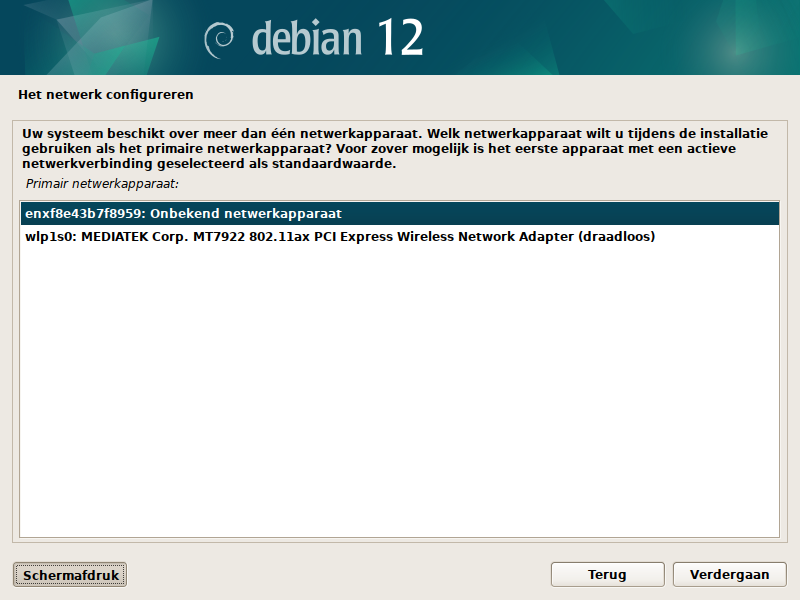
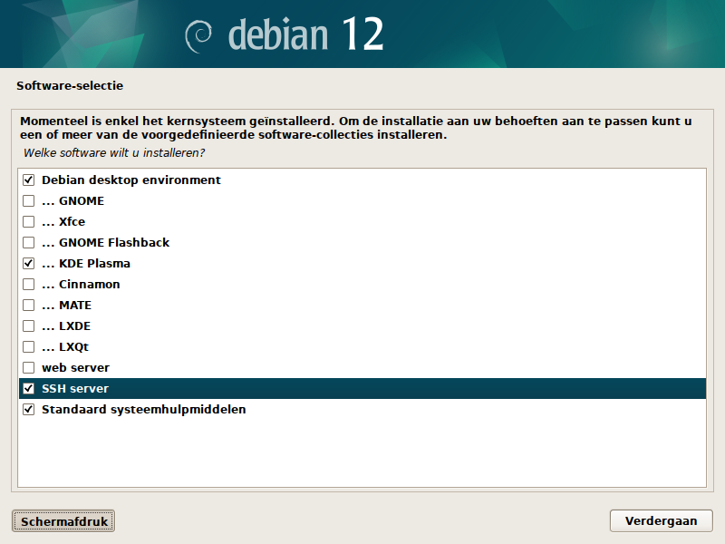

 
# 2025-04-02 - Fresh install

## FrameWork 13 AMD 7040 Series

CPU: __AMD Ryzen 5 7640U w/ Radeon 760M Graphics__


## Memory (64 GiB)

```shell
$ lsmem
RANGE                                 SIZE  STATE REMOVABLE BLOCK
0x0000000000000000-0x000000007fffffff   2G online       yes     0
0x0000000100000000-0x000000107fffffff  62G online       yes  2-32

Memory block size:         2G
Total online memory:      64G
Total offline memory:      0B
```


## Harddisk (SSD 1.0 TiB)

```shell
$ sudo lspci -v -s 02:00.0
02:00.0 Non-Volatile memory controller: Sandisk Corp WD Black SN770 NVMe SSD (rev 01) (prog-if 02 [NVM Express])
        Subsystem: Sandisk Corp WD Black SN770 / PC SN740 256GB / PC SN560 (DRAM-less) NVMe SSD
        Flags: bus master, fast devsel, latency 0, IRQ 90, IOMMU group 13
        Memory at 90a00000 (64-bit, non-prefetchable) [size=16K]
        Capabilities: [80] Power Management version 3
        Capabilities: [90] MSI: Enable- Count=1/32 Maskable- 64bit+
        Capabilities: [b0] MSI-X: Enable+ Count=65 Masked-
        Capabilities: [c0] Express Endpoint, MSI 00
        Capabilities: [100] Advanced Error Reporting
        Capabilities: [1b8] Latency Tolerance Reporting
        Capabilities: [300] Secondary PCI Express
        Capabilities: [900] L1 PM Substates
        Capabilities: [910] Data Link Feature <?>
        Capabilities: [920] Lane Margining at the Receiver <?>
        Capabilities: [9c0] Physical Layer 16.0 GT/s <?>
        Kernel driver in use: nvme
        Kernel modules: nvme

```


## Partitions

```shell
$ sudo lsblk /dev/nvme0n1
NAME                MAJ:MIN RM   SIZE RO TYPE  MOUNTPOINTS
nvme0n1             259:0    0 931,5G  0 disk
├─nvme0n1p1         259:1    0   511M  0 part  /boot/efi
├─nvme0n1p2         259:2    0   512M  0 part  /boot
└─nvme0n1p3         259:3    0 930,5G  0 part
  └─nvme0n1p3_crypt 254:0    0 930,5G  0 crypt
    ├─vg0-root0     254:1    0   128G  0 lvm   /
    └─vg0-home0     254:2    0   128G  0 lvm   /home
```

## Debian Bookworm 12.10

### Network



### TaskSel

* KDE Dutch Desktop
* SSH Server




## Bootstrap


```shell
$ sudo apt install ansible git -y
...
$ git clone https://github.com/cvdg/laptop.git
...
$ cd laptop/
...
$ ansible-playbook -K playbooks/bootstrap.yml
BECOME password:
...
$ sudo reboot
```

## Systemd Warning

This a a warning, as far as I know this is not an error.

The warning happens:
* Debian Bookworm (linux image 6.1)
* Debian Bookworm Backports (linux image 6.11)
* Debian Trixie (linux image 6.12)

```
apr 03 13:17:43 laptop01 kernel: WARNING: CPU: 0 PID: 219 at drivers/gpu/drm/amd/amdgpu/../display/dc/dcn20/dcn20_dsc.c:273 dsc2_disable+0x14c/0x160 [amdgpu]
apr 03 13:17:43 laptop01 kernel: Modules linked in: cdc_ncm cdc_ether usbnet mii sd_mod uas usb_storage scsi_mod scsi_common usbhid amdgpu(+) gpu_sched crc32_pclmul drm_buddy nvme crc32c_intel i2c_algo_bit nvme_core drm_display_helper ghash_clmulni_intel t10_pi cec sha512_ssse3 crc64_rocksoft_generic rc_core sha512_generic xhci_pci crc64_rocksoft drm_ttm_helper hid_multitouch hid_sensor_hub sha256_ssse3 crc_t10dif xhci_hcd ttm hid_generic sha1_ssse3 crct10dif_generic aesni_intel crct10dif_pclmul drm_kms_helper crypto_simd i2c_hid_acpi usbcore crc64 video cryptd drm i2c_hid thunderbolt i2c_piix4 usb_common crct10dif_common battery button wmi hid
apr 03 13:17:43 laptop01 kernel: CPU: 0 PID: 219 Comm: (udev-worker) Not tainted 6.1.0-32-amd64 #1  Debian 6.1.129-1
apr 03 13:17:43 laptop01 kernel: Hardware name: Framework Laptop 13 (AMD Ryzen 7040Series)/FRANMDCP05, BIOS 03.07 02/19/2025
apr 03 13:17:43 laptop01 kernel: RIP: 0010:dsc2_disable+0x14c/0x160 [amdgpu]
apr 03 13:17:43 laptop01 kernel: Code: 00 00 00 75 2c 48 83 c4 18 5b e9 6f d6 e5 c8 8b 4b 10 44 8b 44 24 0c be 02 00 00 00 31 ff 48 c7 c2 08 60 e7 c0 e8 94 41 8e ff <0f> 0b e9 6e ff ff ff e8 78 11 a9 c8 0f 1f 84 00 00 00 00 00 0f 1f
apr 03 13:17:43 laptop01 kernel: RSP: 0018:ffffb618807c3198 EFLAGS: 00010246
apr 03 13:17:43 laptop01 kernel: RAX: 0000000000000000 RBX: ffff99ab54687600 RCX: 0000000000000000
apr 03 13:17:43 laptop01 kernel: RDX: ffffffffc0e76008 RSI: 0000000000000002 RDI: 0000000000000000
apr 03 13:17:43 laptop01 kernel: RBP: 0000000000000001 R08: 0000000000000000 R09: 0000000000000004
apr 03 13:17:43 laptop01 kernel: R10: 0000000000000001 R11: 0000000000000000 R12: ffff99ab6a4001e8
apr 03 13:17:43 laptop01 kernel: R13: ffff99ab4acab000 R14: 0000000000000000 R15: ffff99ab6a4001e8
apr 03 13:17:43 laptop01 kernel: FS:  00007f35b92a58c0(0000) GS:ffff99ba1fe00000(0000) knlGS:0000000000000000
apr 03 13:17:43 laptop01 kernel: CS:  0010 DS: 0000 ES: 0000 CR0: 0000000080050033
apr 03 13:17:43 laptop01 kernel: CR2: 000055edb82e8fb0 CR3: 0000000119eb2000 CR4: 0000000000750ef0
apr 03 13:17:43 laptop01 kernel: PKRU: 55555554
apr 03 13:17:43 laptop01 kernel: Call Trace:
apr 03 13:17:43 laptop01 kernel:  <TASK>
apr 03 13:17:43 laptop01 kernel:  ? __warn+0x7d/0xc0
apr 03 13:17:43 laptop01 kernel:  ? dsc2_disable+0x14c/0x160 [amdgpu]
apr 03 13:17:43 laptop01 kernel:  ? report_bug+0xe2/0x150
apr 03 13:17:43 laptop01 kernel:  ? handle_bug+0x41/0x70
apr 03 13:17:43 laptop01 kernel:  ? exc_invalid_op+0x13/0x60
apr 03 13:17:43 laptop01 kernel:  ? asm_exc_invalid_op+0x16/0x20
apr 03 13:17:43 laptop01 kernel:  ? dsc2_disable+0x14c/0x160 [amdgpu]
apr 03 13:17:43 laptop01 kernel:  ? dsc2_disable+0x14c/0x160 [amdgpu]
apr 03 13:17:43 laptop01 kernel:  dp_set_dsc_on_stream+0x319/0x3f0 [amdgpu]
apr 03 13:17:43 laptop01 kernel:  ? srso_alias_return_thunk+0x5/0x7f
apr 03 13:17:43 laptop01 kernel:  ? dm_helpers_dp_write_dsc_enable+0x260/0x5c0 [amdgpu]
apr 03 13:17:43 laptop01 kernel:  dp_set_dsc_enable+0x71/0x90 [amdgpu]
apr 03 13:17:43 laptop01 kernel:  core_link_disable_stream+0x15a/0x540 [amdgpu]
apr 03 13:17:43 laptop01 kernel:  ? dc_dmub_srv_is_restore_required+0x38/0x80 [amdgpu]
apr 03 13:17:43 laptop01 kernel:  ? srso_alias_return_thunk+0x5/0x7f
apr 03 13:17:43 laptop01 kernel:  ? dm_read_reg_func+0x34/0xb0 [amdgpu]
apr 03 13:17:43 laptop01 kernel:  dc_commit_state_no_check+0x71e/0xce0 [amdgpu]
apr 03 13:17:43 laptop01 kernel:  ? srso_alias_return_thunk+0x5/0x7f
apr 03 13:17:43 laptop01 kernel:  dc_commit_state+0x107/0x120 [amdgpu]
apr 03 13:17:43 laptop01 kernel:  amdgpu_dm_atomic_commit_tail+0x630/0x3700 [amdgpu]
apr 03 13:17:43 laptop01 kernel:  ? srso_alias_return_thunk+0x5/0x7f
apr 03 13:17:43 laptop01 kernel:  ? dsc2_validate_stream+0x37/0x60 [amdgpu]
apr 03 13:17:43 laptop01 kernel:  ? dcn20_validate_dsc+0x18f/0x1c0 [amdgpu]
apr 03 13:17:43 laptop01 kernel:  ? srso_alias_return_thunk+0x5/0x7f
apr 03 13:17:43 laptop01 kernel:  ? dcn30_internal_validate_bw+0x7ac/0x9e0 [amdgpu]
apr 03 13:17:43 laptop01 kernel:  ? srso_alias_return_thunk+0x5/0x7f
apr 03 13:17:43 laptop01 kernel:  ? srso_alias_return_thunk+0x5/0x7f
apr 03 13:17:43 laptop01 kernel:  ? dcn314_validate_bandwidth+0x118/0x330 [amdgpu]
apr 03 13:17:43 laptop01 kernel:  ? srso_alias_return_thunk+0x5/0x7f
apr 03 13:17:43 laptop01 kernel:  ? dc_validate_global_state+0x309/0x3d0 [amdgpu]
apr 03 13:17:43 laptop01 kernel:  ? srso_alias_return_thunk+0x5/0x7f
apr 03 13:17:43 laptop01 kernel:  ? dma_resv_iter_first_unlocked+0x62/0x70
apr 03 13:17:43 laptop01 kernel:  ? srso_alias_return_thunk+0x5/0x7f
apr 03 13:17:43 laptop01 kernel:  ? dma_resv_get_fences+0x5d/0x220
apr 03 13:17:43 laptop01 kernel:  ? srso_alias_return_thunk+0x5/0x7f
apr 03 13:17:43 laptop01 kernel:  ? dm_plane_helper_prepare_fb+0x190/0x2c0 [amdgpu]
apr 03 13:17:43 laptop01 kernel:  ? srso_alias_return_thunk+0x5/0x7f
apr 03 13:17:43 laptop01 kernel:  ? dm_plane_helper_prepare_fb+0x1d3/0x2c0 [amdgpu]
apr 03 13:17:43 laptop01 kernel:  commit_tail+0x91/0x130 [drm_kms_helper]
apr 03 13:17:43 laptop01 kernel:  drm_atomic_helper_commit+0x112/0x140 [drm_kms_helper]
apr 03 13:17:43 laptop01 kernel:  drm_atomic_commit+0x93/0xc0 [drm]
apr 03 13:17:43 laptop01 kernel:  ? drm_plane_get_damage_clips.cold+0x1c/0x1c [drm]
apr 03 13:17:43 laptop01 kernel:  drm_client_modeset_commit_atomic+0x206/0x250 [drm]
apr 03 13:17:43 laptop01 kernel:  drm_client_modeset_commit_locked+0x56/0x160 [drm]
apr 03 13:17:43 laptop01 kernel:  ? srso_alias_return_thunk+0x5/0x7f
apr 03 13:17:43 laptop01 kernel:  drm_client_modeset_commit+0x21/0x40 [drm]
apr 03 13:17:43 laptop01 kernel:  drm_fb_helper_set_par+0x9e/0xe0 [drm_kms_helper]
apr 03 13:17:43 laptop01 kernel:  fbcon_init+0x245/0x540
apr 03 13:17:43 laptop01 kernel:  visual_init+0xc9/0x120
apr 03 13:17:43 laptop01 kernel:  do_bind_con_driver.isra.0+0x1da/0x2e0
apr 03 13:17:43 laptop01 kernel:  do_take_over_console+0x153/0x180
apr 03 13:17:43 laptop01 kernel:  do_fbcon_takeover+0x5a/0xc0
apr 03 13:17:43 laptop01 kernel:  fbcon_fb_registered+0x133/0x140
apr 03 13:17:43 laptop01 kernel:  register_framebuffer+0x1c9/0x300
apr 03 13:17:43 laptop01 kernel:  __drm_fb_helper_initial_config_and_unlock+0x388/0x510 [drm_kms_helper]
apr 03 13:17:43 laptop01 kernel:  drm_fbdev_client_hotplug+0x186/0x220 [drm_kms_helper]
apr 03 13:17:43 laptop01 kernel:  drm_client_register+0x72/0xb0 [drm]
apr 03 13:17:43 laptop01 kernel:  amdgpu_pci_probe+0x3db/0x400 [amdgpu]
apr 03 13:17:43 laptop01 kernel:  local_pci_probe+0x3e/0x80
apr 03 13:17:43 laptop01 kernel:  pci_device_probe+0xc3/0x240
apr 03 13:17:43 laptop01 kernel:  really_probe+0xdb/0x380
apr 03 13:17:43 laptop01 kernel:  ? pm_runtime_barrier+0x50/0x90
apr 03 13:17:43 laptop01 kernel:  __driver_probe_device+0x78/0x120
apr 03 13:17:43 laptop01 kernel:  driver_probe_device+0x1f/0x90
apr 03 13:17:43 laptop01 kernel:  __driver_attach+0xce/0x1c0
apr 03 13:17:43 laptop01 kernel:  ? __device_attach_driver+0x110/0x110
apr 03 13:17:43 laptop01 kernel:  bus_for_each_dev+0x84/0xd0
apr 03 13:17:43 laptop01 kernel:  bus_add_driver+0x1ae/0x200
apr 03 13:17:43 laptop01 kernel:  driver_register+0x89/0xe0
apr 03 13:17:43 laptop01 kernel:  ? 0xffffffffc1147000
apr 03 13:17:43 laptop01 kernel:  do_one_initcall+0x56/0x220
apr 03 13:17:43 laptop01 kernel:  do_init_module+0x4a/0x1f0
apr 03 13:17:43 laptop01 kernel:  __do_sys_finit_module+0xac/0x120
apr 03 13:17:43 laptop01 kernel:  do_syscall_64+0x55/0xb0
apr 03 13:17:43 laptop01 kernel:  ? syscall_exit_to_user_mode+0x1e/0x40
apr 03 13:17:43 laptop01 kernel:  ? srso_alias_return_thunk+0x5/0x7f
apr 03 13:17:43 laptop01 kernel:  ? do_syscall_64+0x61/0xb0
apr 03 13:17:43 laptop01 kernel:  ? srso_alias_return_thunk+0x5/0x7f
apr 03 13:17:43 laptop01 kernel:  ? syscall_exit_to_user_mode+0x1e/0x40
apr 03 13:17:43 laptop01 kernel:  ? srso_alias_return_thunk+0x5/0x7f
apr 03 13:17:43 laptop01 kernel:  ? do_syscall_64+0x61/0xb0
apr 03 13:17:43 laptop01 kernel:  entry_SYSCALL_64_after_hwframe+0x6e/0xd8
apr 03 13:17:43 laptop01 kernel: RIP: 0033:0x7f35b99b67d9
apr 03 13:17:43 laptop01 kernel: Code: 08 89 e8 5b 5d c3 66 2e 0f 1f 84 00 00 00 00 00 90 48 89 f8 48 89 f7 48 89 d6 48 89 ca 4d 89 c2 4d 89 c8 4c 8b 4c 24 08 0f 05 <48> 3d 01 f0 ff ff 73 01 c3 48 8b 0d f7 05 0d 00 f7 d8 64 89 01 48
apr 03 13:17:43 laptop01 kernel: RSP: 002b:00007ffe0ea2e248 EFLAGS: 00000246 ORIG_RAX: 0000000000000139
apr 03 13:17:43 laptop01 kernel: RAX: ffffffffffffffda RBX: 000055edb82c80f0 RCX: 00007f35b99b67d9
apr 03 13:17:43 laptop01 kernel: RDX: 0000000000000000 RSI: 00007f35b9b49efd RDI: 0000000000000014
apr 03 13:17:43 laptop01 kernel: RBP: 00007f35b9b49efd R08: 0000000000000000 R09: 000055edb82a81d0
apr 03 13:17:43 laptop01 kernel: R10: 0000000000000014 R11: 0000000000000246 R12: 0000000000020000
apr 03 13:17:43 laptop01 kernel: R13: 0000000000000000 R14: 000055edb82a9670 R15: 00007ffe0ea2e480
apr 03 13:17:43 laptop01 kernel:  </TASK>
```
